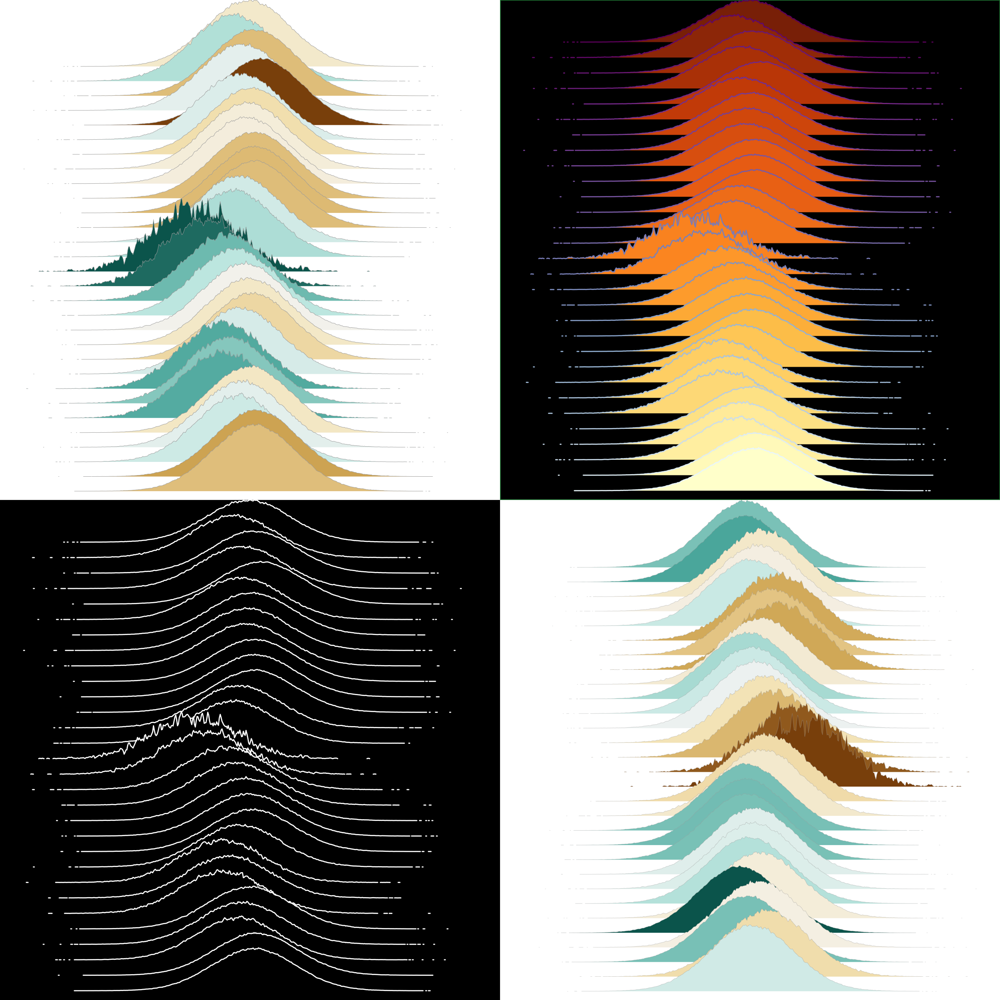
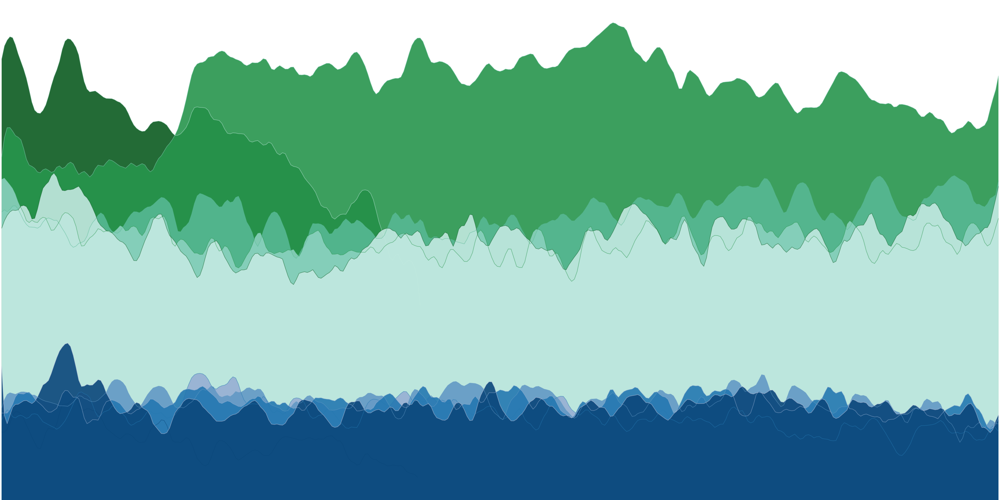
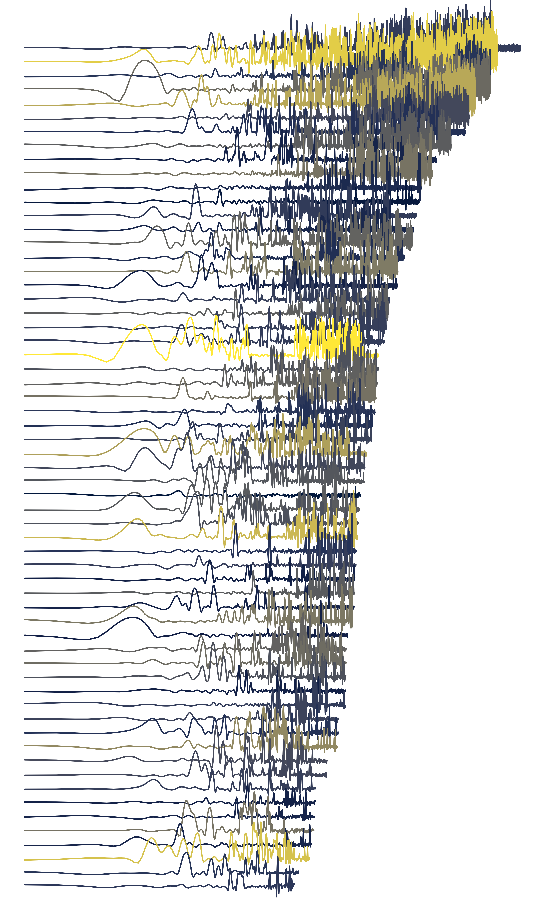

# Hobby

Data and code to generate fun images

#

**Dissociation** - distributions of artificially shredded microbial genomes MinHash distances from self

    -code: dissociation.R

    -data: *self.csv , check.txt , gtdb.tsv

 

 
**Birdsong** - account creation dates of followers of two arguing scientists

    -code: birdsong.R

    -data: birdsong.Rdata (acquired from TWitter API)

 
**Defection** - per base quality of ONT reads described as chimeric, i.e. containing non-retroviral virus sequence(s) integrated into human host genome

    -code: defection.R

    -data: *qhist.txt

